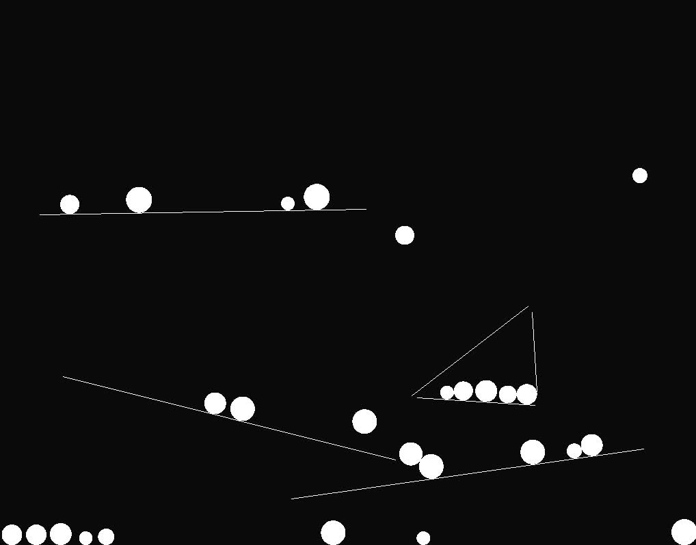

# Verlet particles



This is a basic physics engine written in C.
It supports simulating movement of circle shaped bodies and their collision with lines.

Rendering is facilitated using SDL2.

# Quick start

Project can be built both for Linux:

```console
make
./out
```

Or for web using [Emscripten](https://emscripten.org/)

```
make web
```

*(Output files can be served from `web/`)*


